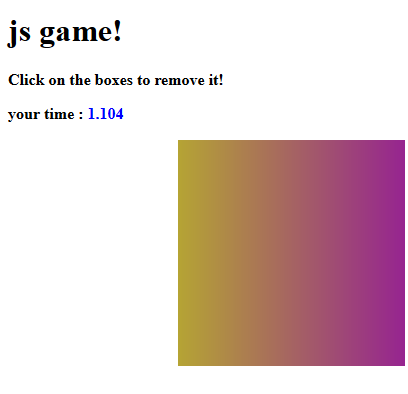

## Javascript assignment

**we want to create js game for the user reaction using the mouse click event**

1.  create the function  `getRandomColor`  tho generate random color to use it for this game
2.  create a function  `getRandomDiv`  to generate random div (random width and height ) with random position to create random Div and to append the div to  the  `body`  

>you need to use `Math.random` for width, height , top , left , you need to style the new div with absolute position
>you can Use `document.body.clientWidth` and `document.body.clientHeight` to set the maximum range for the random `top` and `left` values you generate

3.  add a random background to the generated div.
4.  add (event listener) to the generated div so when the user click on the div it will be removed and new random div should appear in random time between 0 and 2 second using  `Math.random ` 

> you have to use `setTimeout` with `getRandomDiv` with  `Math.random ` for the random time 

5. use `Math.random` to generate random border radius so the div will be randomly rectangle or circle 

> with `div.style.borderRadius:50%` you generate a circle and with `div.style.borderRadius:0` you will generate a Rectangle
6. claculate the time between generating the div and clicking on this div to remove it to know the reaction time of the user and but the time as innerText in the span with id `timeTaken` after clicking on the div. 
> you can use `new Date().getTime()`  as the start time after generating the div and `new Date().getTime()`  as end time after clicking on the div so the reaction time is `start - end` 
> `new Date().getTime()`  calculated with milliseconds [you can read here ](https://developer.mozilla.org/en-US/docs/Web/JavaScript/Reference/Global_Objects/Date/getTime) so you need to divide by 1000 to get the reaction time in seconds

